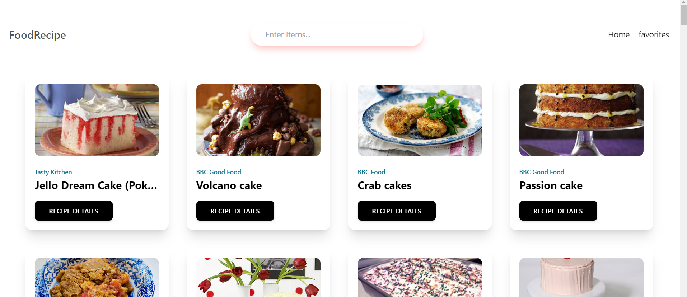

# Food App

This is a simple recipe app built using **React** and **React Router**. The project uses **Tailwind CSS** for styling and includes basic React libraries for testing.

## Project Screenshots

Here are some screenshots of the project:




## Project Setup

To set up and run the project locally, follow these steps:

### Prerequisites

Make sure you have **Node.js** installed on your machine.

### Installation

1. Clone the repository:
   ```bash
   git clone <repository-url>
